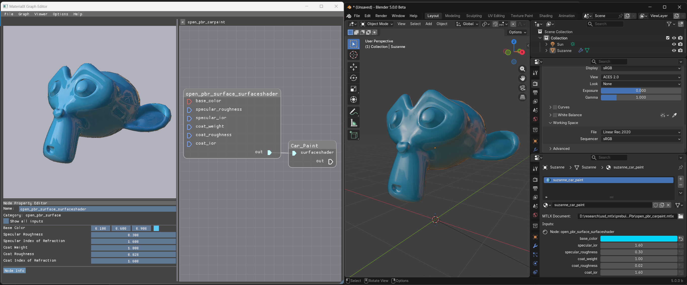
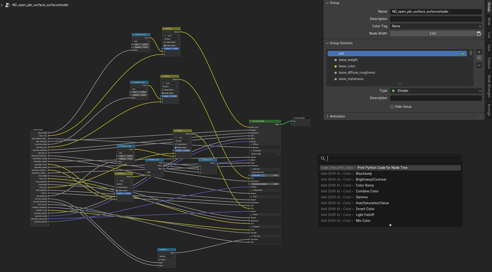
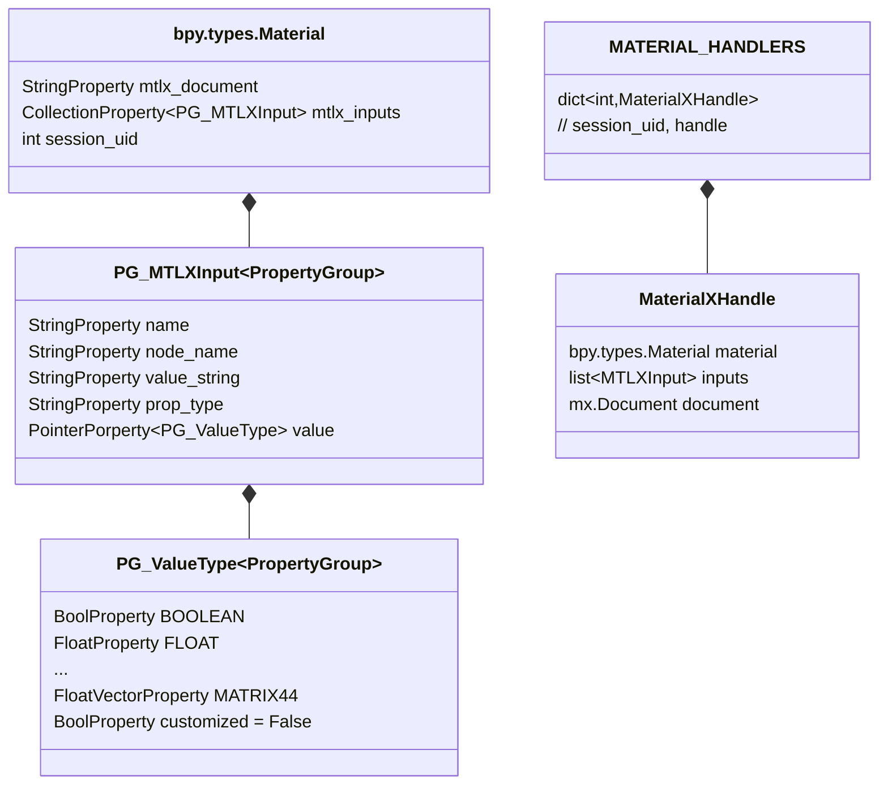

# IO Blender MTLX

This addon enables loading and displaying materials expressed in MaterialX documents in Blender.
It exposes all top level inputs of a document to the Material data block in Blender.

The workflow idea behind this addon is to treat MaterialX materials similar to comparable Material
Graphs in modern game engines. By loading and instanciating them in a Material block, we only change
their input values, similar to how a game engine would treat Material Instances.

## Features

- Load MaterialX Documents
- Modify exposed parameters per instance
- On the fly generation of native Blender Materials (that also work without the addon)
- Serialize changed parameters to Blender Document
- Serialize referenced document and parameters to USD on Export

### Non-Goals and limitations

- No support for modifying MaterialX graphs inside of Blender (recommended to use the [MaterialX Graph Editor](https://github.com/AcademySoftwareFoundation/MaterialX/blob/main/documents/DeveloperGuide/GraphEditor.md) ([Releases](https://github.com/AcademySoftwareFoundation/MaterialX/releases/)))
- Only works on documents that follow reasonable spec
- Serialization back to USD is for reference purposes only
- (Currently) material parameters can not be animated
- Not guaranteed 1:1 match for all render features (limited to Blender's built-in shading nodes capabilities)

### Supported Blender versions and status

- Blender 5.0 and up
  - This addon requires [node bundles](https://docs.blender.org/manual/en/latest/modeling/geometry_nodes/utilities/bundle/index.html)
- Basic Materials should work right now. The following node defs are at least partially supported:
  - `ND_convert_color3_vector3`
  - `ND_convert_color4_color3`
  - `ND_convert_float_color3`
  - `ND_convert_vector4_vector3`
  - `ND_distance_vector3`
  - `ND_extract_color4`
  - `ND_ifequal_color3B`
  - `ND_ifequal_floatB`
  - `ND_ifequal_vector3B`
  - `ND_mix_color3`
  - `ND_mix_vector3`
  - `ND_multiply_color3`
  - `ND_multiply_float`
  - `ND_normalmap_float`
  - `ND_open_pbr_surface_surfaceshader`
  - `ND_surfacematerial`
  - `ND_tiledimage_color4`
  - `ND_tiledimage_float`
  - `ND_tiledimage_vector4`

## Acknowledgements

- [Blender](https://www.blender.org/)
- [MaterialX](https://materialx.org/)
- [OpenUSD](https://openusd.org/)

## Contributions

All contributions are welcome and must respect the MIT License.
Specifically, we're looking for contributions in these formats:

1. Bug reports and feature requests
2. Bug fixes and feature contributions
3. Node Implementations and improvements on Node Implementations

### Bug reports and feature requests

Please use GitHub issues to file new bug reports and feature requests. Always include your Blender
version and if possible a small repro case of both your Blender scene and MaterialX documents.

### Bug fixes and feature contributions

For bug fixes and feature contributions, please link them to a GitHub issue if applicable.

Please avoid introducing additional dependencies. Always be clear in your Pull Requests
what is being added or fixed and how to test.

### Node Implementations

The most crucial contributions are missing node implementations. Node implementations are
Blender node networks that emulate the behavior of one specific MaterialX node definition
expressed as Python code.

#### Generating nodes for the node def

You can create the necessary Python code for new node definitions
by creating a nodegroup in the shader editor. Make sure the group inputs and output follow
the names of the MaterialX names and valuetypes. You also set the group name to the corresponding
node def.

Hit `F3` to bring up the operator search and execute "Print Python Code for Node Tree". You can
copy the contents of the console to the *lib.py file. Make sure the logic is correct and if need
be, fix the generated code.

Please file a Pull Request with a new node and describe if there are any limitations compared
to the MaterialX node.

#### Data types

Not all data types that MaterialX uses can be expressed in Blender's material graph. Or, they
can not be passed around between nodes. Blender's material graph does not support (at least)
- Filepaths
- Strings
- Integers
- Booleans
- Vector2
- Vector4
- Color4 (limited)
- Matrix44
- Matrix33

Blender's UI does support these data types, so we can expose them to the user from the UI,
but we can not use them in our node defs as is. For the Vector2, we can utilize Blender's
Vector (three dimensions) and discard the third element, for Vector4 and Color4 (and Matrix types)
we can make use of Blender's Node Bundles, but have some additional limitations with their usage
(e.g. bundles can not have default values set on them).

Where applicable, we treat Integers and Booleans as Floats and rely on the user input to give
us valid data.

For Strings and Filepaths, we need to set them statically on the node during creation, they
can not come from another node within the graph.

## Development

### Workspace setup

This project is setup using [UV](https://docs.astral.sh/uv/). You can initalize the environemnt
using `uv sync --dev`.

You can pass custom MaterialX libraries by putting the path to the libraries on the
`MATERIALX_SEARCH_PATH` and `PXR_USDMTLX_PLUGIN_SEARCH_PATHS`.

An example of how to launch Blender with the addon and custom search paths is in the
`launch_blender.py` file.

### Technical overview

The addon adds two custom properties to Blender's Material type, one for a document filepath
and one which holds all the inputs we want to be able to control from the Blender Material.

For each Blender material, we hold a `MaterialXHandle` class in memory, which we register
in a singleton dictionary (`MATERIAL_HANDLERS`) using the Material's `session_uid`.

The `MaterialXHandle` is responsible for the following actions:

#### Whenever the Blender Material's filepath is updated:
1. Load the specified MaterialX Document into memory
2. Read all the inputs exposed in the MaterialX Document
    - All serialized inputs on top level nodes and nodegraphs
3. Store matching inputs on the Blender Material's property group

#### Whenever any of the Blender Material's inputs are changed:
1. Apply any changes in inputs from Blender to the MaterialX document
2. Create a new *flattened* MaterialX Document from the original document
    1. Make all filepaths absolute
    1. For each nodegraph recursively push its nodes to the top graph
    1. For each node check if it exists as a Blender node definition
        1. If there is no node defintion, see if the node has a nodegraph implementation
            and split it up further, until we (hopefully) find a Blender node definition
3. Take the flattened document and generate a node graph in Blender from its contents

## Existing work

- [Jared Webber's original MTLX addon for Blender 2.79](https://github.com/lvxejay/MaterialX-Capstone)
    - This addon seems no longer supported
- [AMD Hydra Addon with some MaterialX support](https://github.com/GPUOpen-LibrariesAndSDKs/BlenderUSDHydraAddon)
    - This addon seems no longer supported
- [Ben Houston's MaterialX Exporter](https://github.com/bhouston/blender_materialx_addon)
    - Actively maintained addon that operates in the opposite direction:
      It allows exporting of MaterialX documents from native Blender materials
- [Bernard Kwok's MaterialX Resources](https://github.com/kwokcb)
    - Great resources, including Python stubs, for MaterialX
